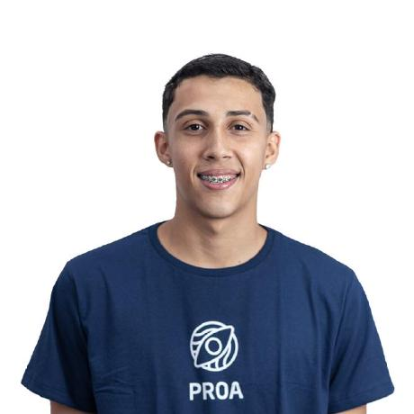

<h1 align=center> DevOps </h1>

### OBJETIVO

Este repositório tem como objetivo centralizar e organizar as entregas das atividades relacionadas à disciplina de DevOps.


### SOBRE O PROJETO

Este projeto consiste em um jogo da memória, utilizando um sistema de login para autenticação de usuários. O objetivo é aplicar boas práticas de desenvolvimento de software e utilizar metodologias ágeis, com versionamento e colaboração via GitHub e Trello. 
O sistema foi construído com Python e Flask, garantindo uma estrutura simples e eficiente para comunicação entre frontend e backend. Além disso, a interface foi projetada para proporcionar uma experiência intuitiva e dinâmica para o jogador.


### DOWNLOAD DO PROJETO

Baixe o projeto em seu computador através do comando:

```bash
git clone https://github.com/HenryModesto/DevOps/
```

**ou**

1. Clique em `<> Code`.
2. Faça o download do arquivo ZIP.
3. Abra o seu explorador de arquivos na localização da instalação.
4. Extraia o arquivo ZIP.

#
### ACESSO PELO TERMINAL 

Após a instalação:

1. Clique com o botão direito do mouse na pasta `HenryModesto/DevOps`.
2. Selecione "Abrir no Terminal".

#
### COMANDOS DE COMMITE

1. Verificar se tem o Flask instalado:

```bash
Flask --version
```

2. Caso não tenha utilize esse comando no terminal:

```bash
pip install Flask
```

3. Necessário Docker

```bash
https://docs.docker.com/desktop/setup/install/windows-install/
```

#
### EQUIPE

<table align="center">
  <tr>
    <td align="center">
      <a href="https://github.com/HenryModesto" title="Github Henry">
        <br>
        <sub>
          <b>HENRY MODESTO</b><br>
          <b>2401244</b>
        </sub>
      </a>
    </td>
    <td align="center">
      <a href="https://github.com/GabryelVenancio" title="Github Gabryel Venancio">
        <br>
        <sub>
          <b>GABRYEL VENANCIO</b><br>
          <b>2302495</b>
        </sub>
      </a>
    </td>
    <td align="center">
      <a href="https://github.com/AndreyT1224" title="Github Andrey">
        <br>
        <sub>
          <b>ANDREY TOMAZ</b><br>
          <b>2400729</b>
        </sub>
      </a>
    </td>
    <td align="center">
      <a href="https://github.com/Biiaiiab" title="Github Beatriz">
        <br>
        <sub>
          <b>BEATRIZ ALVES</b><br>
          <b>2401121</b>
        </sub>
      </a>
    </td>
     <td align="center">
      <a href="https://github.com/JanainaFi" title="Github Janaina">
        <br>
        <sub>
          <b>JANAINA FIGUEIREDO</b><br>
          <b>2400683</b>
        </sub>
      </a>
    </td>
    <td align="center">
      <a href="https://github.com/mauricio003" title="Github Mauricio">
        <br>
        <sub>
          <b>MAURICIO COSTA</b><br>
          <b>2400487</b>
        </sub>
      </a>
    </td>
    
  </tr>
</table>

#
### TECNOLOGIAS
&nbsp;
&nbsp;


### FERRAMENTAS

&nbsp;
&nbsp;
&nbsp;

